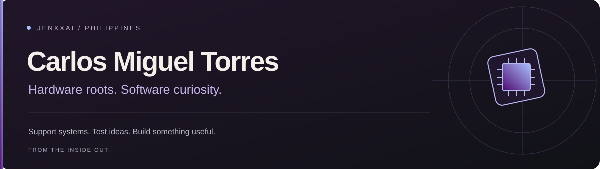

  

  <a href="https://carlos-torres-portfolio.vercel.app"><strong>Portfolio</strong></a>
  &nbsp;·&nbsp;
  <a href="https://www.linkedin.com/in/carlos-miguel-torres-2644a9332/">LinkedIn</a>
  &nbsp;·&nbsp;
  <a href="mailto:torjarica@gmail.com">Email</a>
  &nbsp;·&nbsp;
  <a href="https://www.facebook.com/JenxxAi">Facebook</a>

## From the inside out.

I'm **Carlos Miguel Torres**, a BSIT graduate from **State University of Northern Negros (SUNN)**, based in Negros Occidental, Philippines.

My path started with university computer labs: troubleshooting hardware, maintaining computers, and helping with networks and servers. That curiosity carried me into software quality, automation, and now production support.

I also build full-stack side projects for Filipino community, school, church, and small-business use cases—with AI as part of my development workflow. Outside code, I explore graphic design and ways to make repetitive work a little less repetitive.

**Currently:** Technical Support Engineer at **GrowSari**, since **August 31, 2026**.  
**Next direction:** building toward **DevOps and cloud engineering**.

## The journey so far

| When | Chapter |
| --- | --- |
| **Jun 2024 – Jun 2026** | **Tech Support Volunteer · SUNN** — Supported university offices and computer labs across hardware, software, networks, and servers alongside my BSIT studies. |
| **Late Jan – late Apr 2026** | **QA Engineer Intern · GrowSari** — Joined the Operations squad, testing Last Mile and Backhaul systems and documenting test cases, findings, and evidence. |
| **Late Apr – late Aug 2026** | **Extended QA Internship · GrowSari** — Continued with the team, expanded web admin testing, and explored Playwright, QApilot, and n8n-assisted workflows. |
| **Jun 2026** | **Graduated with a BSIT from SUNN** and received the **Outstanding Intern Award**. |
| **Aug 31, 2026 – present** | **Technical Support Engineer · GrowSari** — Moved from staging-focused QA work into supporting production systems as a regular employee. |

## What I work with

Different tools, one habit: understand the problem before choosing the fix.

| Area | Experience & tools |
| --- | --- |
| **Support & troubleshooting** | PC hardware, software issues, computer lab maintenance, network/server support, production troubleshooting |
| **Quality & investigation** | Manual and regression testing, test cases and evidence, Postman, Playwright, QApilot, Jira, Testpad, Android Studio, HTTP Toolkit, Swagger |
| **Web & data** | React, Next.js, TypeScript, JavaScript, Tailwind CSS, PHP, Python, MySQL, Supabase |
| **Automation & delivery** | n8n workflows, test data automation, GitHub, Vercel |
| **Creative work** | Freelance graphic design, visual experiments, workflow documentation |

## Things I'm building

A mix of side projects and concepts, connected by practical problems and local stories.

| Project | The idea | Tools / stage |
| --- | --- | --- |
| **Pondu** | A paluwagan tracker for community contributions. | React · Vite · Supabase |
| **Pinoy Luto** | An AI recipe app with Filipino kitchens in mind. | Next.js · AI |
| **Chicken Pastil-Anne** | An ordering system connected to messaging and automated workflows. | Messenger · n8n |
| **LinkGuard** | A URL scanner exploring safer everyday browsing. | Security-focused side project |
| **PCBlueprint.io** | A hardware-focused side project. | Project details coming soon |
| **Computer Lab Monitoring System** | Monitoring built around a school computer lab use case. | School systems |
| **Bayani ni Andoy** | Exploring Filipino storytelling through a game. | Game concept |

<strong>More projects from my learning journey</strong>

 

| Project | Focus | Stack |
| --- | --- | --- |
| **Negros CET Survey** | Community survey data and live analytics | Next.js · Supabase · Tailwind CSS |
| **Enrollment System** | Student admission and admin approval workflows | PHP · MySQL · JavaScript |
| **Facial Recognition Attendance** | Automated attendance | PHP · MySQL · Facial recognition API |
| **AI Menu Recommender** | Meal suggestions from image recognition | Flask · Roboflow · Render |

[Explore my portfolio →](https://carlos-torres-portfolio.vercel.app)

## What comes next

- Deepen my understanding of the production systems I support.
- Build on my QA experience with useful automation and clearer documentation.
- Develop the infrastructure foundations for a future in DevOps and cloud.
- Keep building for the communities around me.

## Let's connect

Have a project, a tricky problem, or notes to compare?

**[torjarica@gmail.com](mailto:torjarica@gmail.com)**  
[LinkedIn](https://www.linkedin.com/in/carlos-miguel-torres-2644a9332/) · [Facebook](https://www.facebook.com/JenxxAi) · [Portfolio](https://carlos-torres-portfolio.vercel.app)

---

*There's still room for improvement—and plenty left to explore.*

